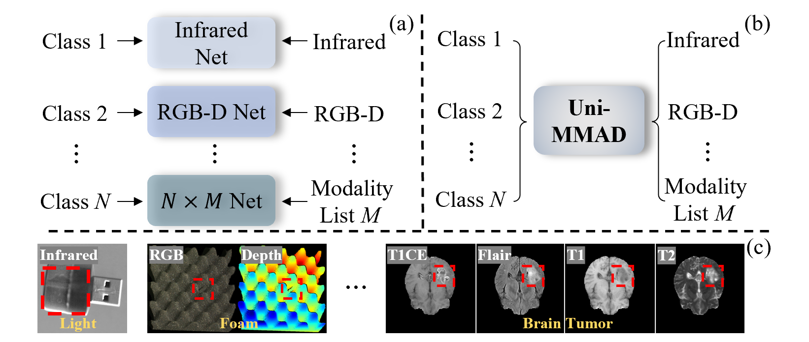
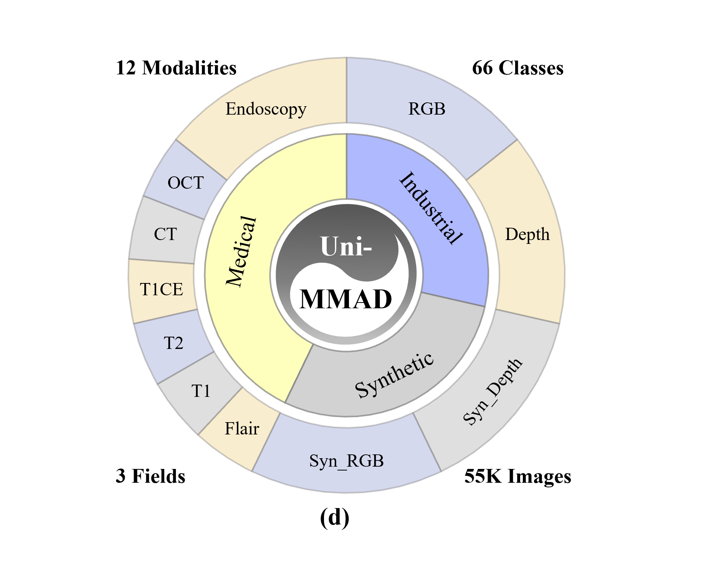

<div align="center">
 
## UniMMAD: Unified Multi-Modal and Multi-Class Anomaly Detection </br> via MoE-Driven Feature Decompression


### CVPR 2026 
[](https://arxiv.org/abs/2509.25934) [](https://arxiv.org/abs/2509.25934)

</div>

PyTorch Implementation of CVPR 2026
"UniMMAD: Unified Multi-Modal and Multi-Class Anomaly Detection via MoE-Driven Feature Decompression". The first unified multi-modal and multi-class UAD model !!!

- **If you find this work useful, please star ⭐ the repo!**

- This project is released under **Apache-2.0 License**. 

## News
 
 - _03.2026_: We have released the dataset, training/evaluation code, and pre-trained weights.🎉
   
 - _02.2026_: Accepted by CVPR 2026🎉
 
 - _09.2025_: We have released the arXiv paper of UniMMAD v1, link:[https://arxiv.org/abs/2509.25934](https://arxiv.org/abs/2509.25934) .😛


## 🚀 TODO
- [x] Release arXiv paper
- [x] open training code
- [x] open testing code
- [x] release MMAD  Datasets
- [x] release pre-trained UniMMAD Weights

## Introduction 
 UniMMAD, a unified framework for multi-modal and
multi-class anomaly detection. At the core of UniMMAD is
a Mixture-of-Experts (MoE)-driven feature decompression
mechanism, which enables adaptive and disentangled reconstruction tailored to specific domains.This process is guided
by a “general → specific” paradigm. In the encoding stage,
multi-modal inputs of varying combinations are compressed
into compact, general-purpose features. The encoder incorporates a feature compression module to suppress latent
anomalies, encourage cross-modal interaction, and avoid
shortcut learning. In the decoding stage, the general features
are decompressed into modality-specific and class-specific
forms via a sparsely-gated cross MoE, which dynamically
selects expert pathways based on input modality and class.
To further improve efficiency, we design a grouped dynamic
filtering mechanism and a MoE-in-MoE structure, reducing
parameter usage by 75% while maintaining sparse activation and fast inference. UniMMAD achieves state-of-the-art
performance on 9 anomaly detection datasets, spanning 3
fields, 12 modalities, and 66 classes. 

## MMAD Task

<div style="display: flex; justify-content: space-between;">
  
  
</div>

Note:  (a) Existing methods rely on specialized models tailored to individual modalities and classes. (b) The proposed UniMMAD model unifies multi-modal and multi-class anomaly detection tasks within a single framework. (c) Visual examples, with modalities highlighted in white, class names in yellow, and anomaly regions marked by red boxes.  (d) Overview of the fields, modalities, and classes encompassed by UniMMAD.


## Get Started 


### Environment 

```bash

pip install -r requirements.txt

```


### Train

1. **Prepare Data**: Download the dataset and define your root directory path in the config.json.

2. **Encoder Weights**: [Download](https://drive.google.com/file/d/1hJ8Ez4lqvzN4GPhiCEl0cm1nd-rWyzAN/view?usp=sharing) the WideResNet encoder weights and place them in the checkpoints folder (e.g., checkpoints/wide_resnet50_2.safetensors).

3. **Launch Training**:

```bash

accelerate launch main.py --mode train 

```


### Test

1. **Model Weights**: Download the trained model weights and provide the path to checkpoint_path.

```bash

accelerate launch main.py --mode eval --resume checkpoint_path

```

Note: You can configure specific classes for training and testing in mmad_datasets/datasets_classes.

### Data


```

root

|-- EyePre

|-- mvtec3d

|-- MulSen_AD

|-- BratsAD1K

|-- HyperAD

|-- LiverAD

|-- RetinaAD

```


## Metric
We use the evaluation toolkit from [PyADMetric_EvalToolkit](https://github.com/yuanzhao-CVLAB/PyADMetric_EvalToolkit), which supports AUROC, AUPR, AP, AUPRO, and F1-max. It leverages GPU acceleration, achieving a  real-time evalution.

## 📁 datasets & checkpoints Links


| Item | Datasets | Model Weights |
|------|----------|---------------|
| UniMMAD |  [Download](https://huggingface.co/datasets/zhaoyuan666/MMAD) | [Download](https://drive.google.com/file/d/16f4ZDUzIJRtpGd_9WvIt-ZnTIuE5wKWq/view?usp=sharing) |


## Star History

[](https://www.star-history.com/#yuanzhao-CVLAB/UniMMAD&Timeline)****
