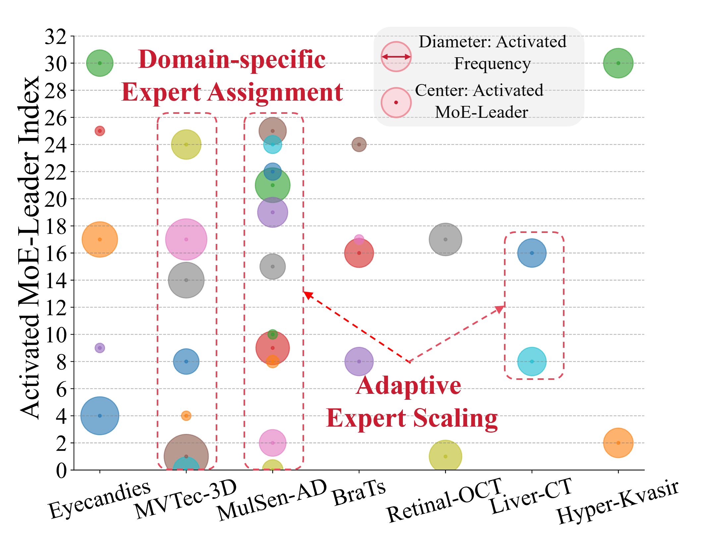

# UniMMAD

> Official PyTorch Implementation of [UniMMAD: Unified Multi-Modal and Multi-Class Anomaly Detection via MoE-Driven Feature Decompression]([https://www.arxiv.org/pdf/2505.09926](https://arxiv.org/pdf/2509.25934), 2025.

## Introduction 
 UniMMAD, a unified framework for multi-modal and
multi-class anomaly detection. At the core of UniMMAD is
a Mixture-of-Experts (MoE)-driven feature decompression
mechanism, which enables adaptive and disentangled reconstruction tailored to specific domains.This process is guided
by a “general → specific” paradigm. In the encoding stage,
multi-modal inputs of varying combinations are compressed
into compact, general-purpose features. The encoder incorporates a feature compression module to suppress latent
anomalies, encourage cross-modal interaction, and avoid
shortcut learning. In the decoding stage, the general features
are decompressed into modality-specific and class-specific
forms via a sparsely-gated cross MoE, which dynamically
selects expert pathways based on input modality and class.
To further improve efficiency, we design a grouped dynamic
filtering mechanism and a MoE-in-MoE structure, reducing
parameter usage by 75% while maintaining sparse activation and fast inference. UniMMAD achieves state-of-the-art
performance on 9 anomaly detection datasets, spanning 3
fields, 12 modalities, and 66 classes. 

## MMAD Task

  
  

Note:  (a) Existing methods rely on specialized models tailored to individual modalities and classes. (b) The proposed UniMMAD model unifies multi-modal and multi-class anomaly detection tasks within a single framework. (c) Visual examples, with modalities highlighted in white, class names in yellow, and anomaly regions marked by red boxes.  (d) Overview of the fields, modalities, and classes encompassed by UniMMAD.

## C-MoE Visualization
 

Note: Activation frequency of each MoE-leader across different datasets, illustrating domain-specific expert selection.

## UniMMAD Framework

## Quantitative Comparison for Super-Multi-Class

| Method ↓            | MVTec-AD Image-level | MVTec-AD Pixel-level | VisA Image-level | VisA Pixel-level |
|----------------------|-----------------------|-----------------------|------------------|------------------|
| RD  | 95.8 / 97.8 / 95.0   | 95.1 / 51.5 / 90.7   | 88.4 / 89.9 / 86.7 | 96.8 / 33.3 / 38.7 |
| UniAD | 95.0 / 97.7 / 94.5   | 95.8 / 46.8 / 90.0   | 90.7 / 92.2 / 86.9 | 98.3 / 32.1 / 38.1 |
| ViTAD | 97.7 / 99.3 / 97.5   | 95.9 / 49.8 / 89.4   | 89.1 / 90.4 / 85.4 | 98.0 / 34.6 / 39.8 |
| MambaAD  | 94.7 / 97.7 / 94.5   | 96.3 / 51.5 / 90.5   | 90.2 / 91.4 / 87.5 | 97.7 / 33.3 / 39.4 |
| INP-Former  | 99.2 / 99.5 / 98.6 | **98.2 / 60.7 / 93.8** | 95.2 / 95.7 / 91.9| 98.8 / 40.5 / 44.4 |
| **Ours**             | **99.4 / 99.6 / 98.7** | 98.1 / 60.2 / 93.0 | **95.5 / 96.2 / 92.4** | **98.9 / 44.9 / 47.2** |

Note:  Quantitative comparison on the MVTec-AD and VisA datasets under the super–multi-class setting with a resolution of $256 \times 256$, evaluated using image-level metrics ($\text{AUC}_I /\text{AP}_I / \text{MF1}_I$) and pixel-level metrics (  $\text{AUC}_P /\text{MF1}_P / \text{AUPRO}$).

## ToDo List
- [ ] release pre-trained UniMMAD models
- [ ] open testing code
- [ ] open training code

## Star History

